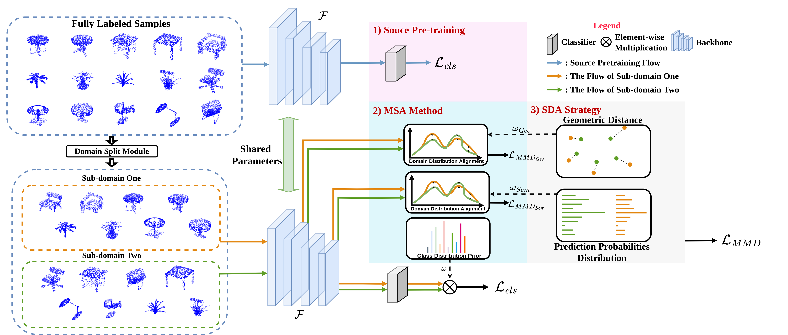

# SUG: Single-dataset Unified Generalization for 3D Point Cloud Classification

Although Domain Generalization (DG) problem has been fast-growing in the 2D image tasks, its exploration on 3D point cloud data is still insufficient and challenged by more complex and uncertain cross-domain variances with uneven inter-class modality distribution. In this paper, we propose a Single-dataset Unified Generalization (SUG) framework that only leverages a single source dataset to alleviate the unforeseen domain differences faced by a well-trained source model. Specifically, we first design a Multi-grained Sub-domain Alignment (MSA) method, which can constrain the learned representations to be domain-agnostic and discriminative, by performing a multi-grained feature alignment process between the splitted sub-domains from the single source dataset. Then, a Sample-level Domain-aware Attention (SDA) strategy is presented, which can selectively enhance easy-to-adapt samples from different sub-domains according to the sample-level inter-domain distance to avoid the negative transfer. Experiments demonstrate that our SUG can boost the generalization ability for unseen target domains, even outperforming the existing unsupervised domain adaptation methods that have to access extensive target domain data.




## Requirements

### Setup from scratch
- Python 3.8
- PyTorch 1.8.0
- others from requirements.txt
- chamfer distance from: https://github.com/otaheri/chamfer_distance

### Docker Environment
1. Ensure that you have installed Docker, NVIDIA-Container toolkit
2. Export data and log (optional) env variable, which will let the docker have the volume attach to the data and log folder.

```
    export DATA=/hdd1/huangsiyuan/PointDA_data/
    export LOG=/hdd1/huangsiyuan/logs/
```
3. To let the docker have the GPU access, make nvidia the default runtime in /etc/docker/daemon.json:
```
{
    "runtimes": {
        "nvidia": {
            "path": "/usr/bin/nvidia-container-runtime",
            "runtimeArgs": []
        } 
    },
    "default-runtime": "nvidia" 
}
Save the file and run sudo systemctl restart docker to restart docker.
```
4. build the docker:

```
make build
```

5. Finally, run the container with
```
make run
```

6. If you meet the problem:
```
ERROR: Couldn’t connect to Docker daemon at http+docker://localunixsocket - is it running?
```
- sudo gpasswd -a ${USER} docker
- sudo su
- su USERNAME

### Other dependiences

1. Chamfer Distance

```shell
pip install git+'https://github.com/otaheri/chamfer_distance'
```

## Data Download
Download the [PointDA-10](https://drive.google.com/file/d/1-LfJWL5geF9h0Z2QpdTL0n4lShy8wy2J/view?usp=sharing) and extract it as the dataset fold. 

## Train & Test
If you run the experiment on one generalization scanerio, like modelnet to others:
```
python train_dg_single_gpu.py --source modelnet --cfg tools/cfgs/DG_unifider_loss.yaml
```

## File Structure

```shell
|-data/    # contains the dataloader/ data-processing related
|-imgs/    # pictures for visualization
|-tools/   # contains the configs and shell scripts
|-model/   # alignment model + backbones
|-utils/   # util for training/visualization
|-docker*  # docker related files
|-train_dg_naive_mmd.py   # Naive MMD, mostly similar with PointDAN
|-train_dg_single_gpu.py  # main funcation, to conduct the DG operation
|-train_dg.py             # WIP use multi-gpu to speed-up the training process
|-train_source.py         # Source-only training and inference
|-train_uda.py            # Compare with UDA PointDAN.
```

## Acknowledgement
Some of the code in this repoistory was taken (and modified according to needs) from the follwing sources: [PointNet](https://github.com/charlesq34/pointnet), [PointNet++](https://github.com/charlesq34/pointnet2), [DGCNN](https://github.com/canqin001/PointDAN), [PointDAN](https://github.com/canqin001/PointDAN), [Point Transformer](https://github.com/qq456cvb/Point-Transformers), [KPConv](https://github.com/HuguesTHOMAS/KPConv-PyTorch).
